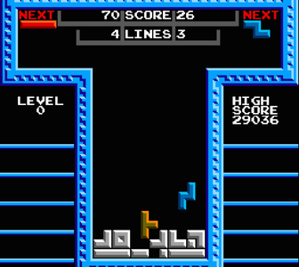

# Projeto Tretris
## FPRO/MIEIC, 2020/21
## Adam Gershenson Nogueira (up202007519)
## 1MIEIC07

### Objetivo

Criar um clone do clássico Tetris em pygames, com adição de PvP e alguns possíveis modificadores.

### Descrição

O objetivo do Tretris é aguantar o mais tempo possível. Existem blocos que caiem e é possível eliminá-los preenchendo uma linha na horizontal. Quando os blocos chegarem até cima, o jogador perde.

### UI

### Pacotes

- Pygame

### Tarefas

1. [ ] desenhar bloco a cair (posição, forma)
1. [ ] quando o bloco chega abaixo fica a fazer parte da matriz do jogo
1. [ ] teclas movem bloco para os lados
1. [ ] linha na horizontal elimina
1. [ ] jogo acaba quando bloco fica em cima
1. [ ] melhorias no interface, estatísticas
1. [ ] modos 2 jogadores: co-op e competitivo
